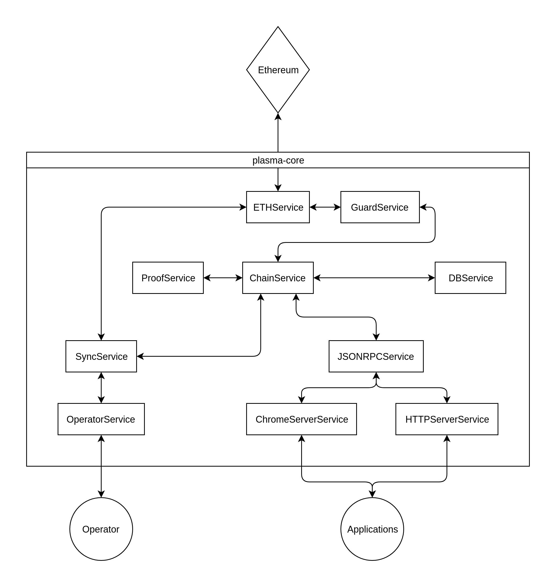

# plasma-core
[](https://coveralls.io/github/plasma-group/plasma-core?branch=master)

`plasma-core` is Plasma Group's core node software. With `plasma-core`, you can either launch a node from your command line or include the library into another project to add additional functionality. 

This repository does not provide a graphical user interface. If you're looking to report an issue or work on the Plasma Group chrome extension, head to the seperate [`plasma-extension`](https://github.com/plasma-group/plasma-extension) repository.

## Contributing
Welcome! If you're looking to contribute to `plasma-core`, you're in the right place.

### Contributing Guide and CoC
Plasma Group follows a [Contributing Guide and Code of Conduct](https://github.com/plasma-group/plasma-core/blob/master/.github/CONTRIBUTING.md) adapted slightly from the [Contributor Covenant](https://www.contributor-covenant.org/version/1/4/code-of-conduct.html). All contributors are expected to read through this guide. We're here to cultivate a welcoming and inclusive contributing environment, and every new contributor needs to do their part to uphold our community standards.

### Requirements and Setup
#### Node.js
`plasma-core` is a [`Node.js`](https://nodejs.org/en/) application. You'll need to install `Node.js` (and it's corresponding package manager, `npm`) for your system before continuing.

`plasma-core` has been tested on the following versions of Node:

- 10.14.2

If you're having trouble getting a component of `plasma-core` running, please make sure you have one of the above `Node.js` versions installed.

#### Packages
`plasma-core` makes use of several `npm` packages.

Install all required packages with:

```
$ npm install
```

### Running Tests
`plasma-core` makes use of a combination of [`Mocha`](https://mochajs.org/) (a testing framework) and [`Chai`](https://www.chaijs.com/) (an assertion library) for testing.

Run all tests with:

```
$ npm test
```

**Contributors: remember to run tests before submitting a pull request!** Code with passing tests makes life easier for everyone and means your contribution can get pulled into this project faster.

## Architecture


